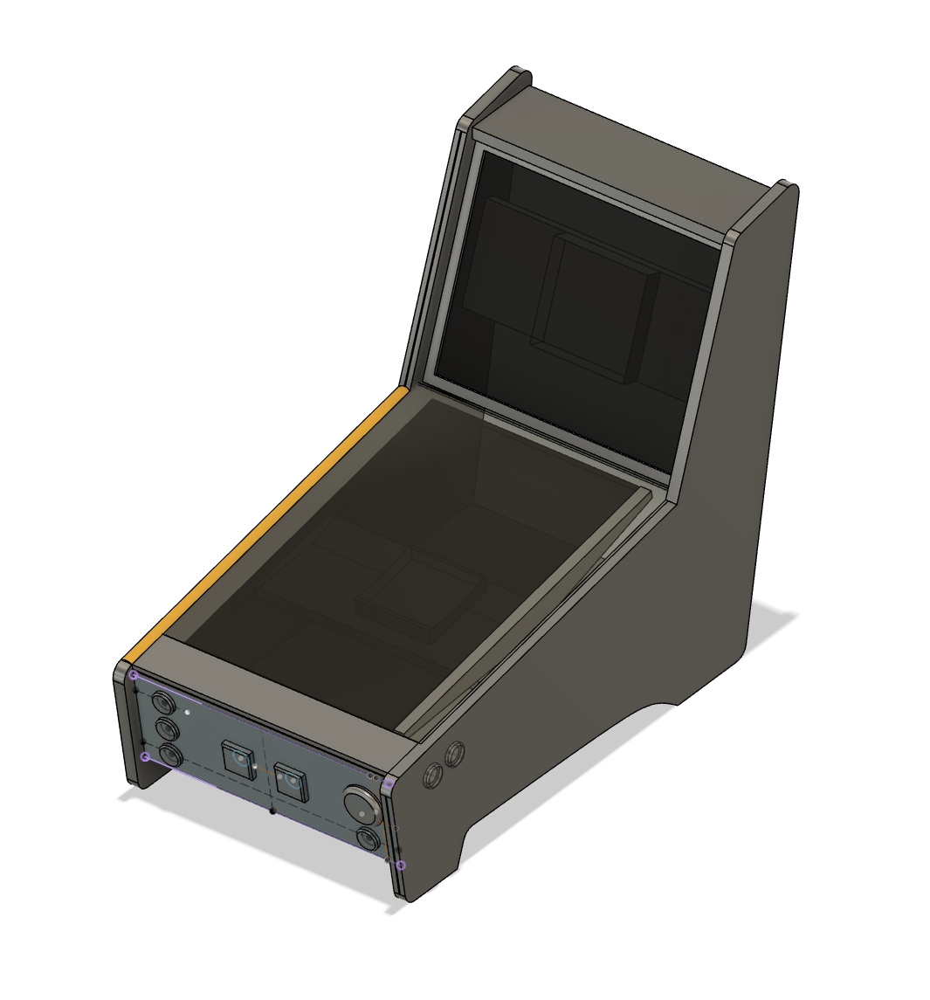

## Zelf een Virtual Pinball Cabinet bouwen

In februari 2020 heb ik besloten een eigen virtual pinball mini cabinet te gaan bouwen. Mini, of eigenlijk table top (voor op tafel), omdat de maten van een echte flipperkast veel te groot zijn voor mijn woning. Bovendien vind ik die kasten te log en lelijk. De echte maten en met name de verhoudingen worden wel door veel pinball software als uitgangspunt genomen, dus hou hier rekening mee. 

Ik had nog twee ongebruikte 19" en 23,8" monitors die ik mooi als backbox en playfield kon gebruiken. De 19" is 5:4 dus bijna vierkant, perfect voor de backbox. Het playfield heeft normaal een 18,7:9 verhouding, de 23,8" monitor heeft helaas een 16:9 verhouding, 21:9 had mooier geweest, maar die heb ik niet liggen en kosten (door de bijzondere verhouding) nog steeds best wat duiten. 

Er zijn genoeg tekeningen online te vinden van het traditionele ontwerp van een pinball cabinet, maar zoals gezegd vind ik dit geen mooi ontwerp. Dus ben ik gaan schetsen en klooien in Fusion360 (een 3D CAD tekenprogramma) om te kijken welk ontwerp ik gaaf vind. Het doel is om een retro arcade achtige uitstraling te krijgen. Dus t-molding, ronde hoeken gecombineerd met hoekige lijnen en gave pinball artwork decals (bestickering) erop. Verder is een eis dat het playfield niet op de tafel rust, maar verhoogt (met pootjes oid), ivm koeling en speakers in de onderplaat (die lucht en bewegings ruimte moeten hebben). De hoek van het playfield moet ik nog mee spelen, maar ik verwacht iets van 10-15 graden. Tot slot wil ik graag een Kinect (van de XBOX360) bovenop de kast kunnrn zetten zodat mbv Better Arcade Mode (BAM) in Future Pinball een soort 3D weergave mogelijk is, waardoor het playfield er heel realistisch uitziet en je echt om objecten in het speelveld heen kunt kijken (door de headtracking van de Kinect).

Het mooie aan Fusion360 is dat (als het goed is) je met je ontwerp naar een houtzagerij kan gaan en dat zij op basis van die tekeningen je planken kunnen "uitprinten", CNC-en heet dit. Daarnaast ontdek je door het klooien in 3D al vroeg knelpunten in je ontwerp, voordat je het laten produceren en je dan dus met een probleem zit. Dat scheelt heel wat frustratie, tijd en geld. En ik heb gemerkt dat je al gauw varianten en verbeteringen op je ontwerpen gaat maken, waardoor je soms heel anders eindigt met waarmee je begon (had ook zonde geweest van al het hout en materiaal). Voor het schetsen in Fusion was het handig dat ik alle maten van de onderdelen bij de hand had, vandaar de [tabel met afmetingen](#afmetingen).

### Pinball software

Parallel aan het tekenen van het cabinet in Fusion360 ben ik aan de slag gegaan met het installeren en configureren van de Pinball software. Ik speelde uitsluitend op de PS4 Pinball FX3 en heb alle tot nu 96 tafels aangeschaft. De kasten die zij hebben gemaakt hebben animaties, scenes en gameplay, bijna videogame achtig dat onmogelijk op een echte flipperkant zou kunnen, maar dus wel op een virtuele! Dit is ook uitgebracht voor de PC via Steam op Windows met een zgn cabinet mode. Cabinet mode maakt het mogelijk dat je de DMD (scores) en backglass op een tweede (of derde) scherm kunt weergeven. Gebruik niet de versie via de Windows store - daar werkt de cabinet mode niet. Daarnaast bestaat er een enorme community van mensen die zelf digitale/virtual pinball kasten maken mbv Future Pinball. Dit is dus gratis, maar is niet plug and play zoals FX3 en de originele bedenkders van de kast krijgen hier dus geen royalties oid voor terug. Ik steun die bedenkers graag en betaal met liefde die paar euro's voor aan commerciele kasten. Met als win/win dat de betaalde software veel beter en sneller aan de praat is te krijgen. Het configureren en aan de praat krijgen van Future Pinball en BAM is echt veel handwerk, trial & error en diverse fora afspeuren.

#### Pinball FX3
Installeren van Steam en Pinball FX3 is eenvoudig, hoef ik niet uit te leggen. Maar wat je wel moet weten, is dat je direct een Pinball FX3 tafel kunt starten (zonder in Steam zelf eerst naar het spel te hoeven navigeren),

- Maak een shortcut met als doel "C:\Program Files (x86)\Steam\Steam.exe" -applaunch 442120 -class -table_"Citadel"
- De opties -silent en -tenfoot werkte bij niet
- De beschikbare table names vind je hier (let op deze tafel moet je wel aangeschaft hebben) : C:\Program Files (x86)\Steam\steamapps\common\Pinball FX3\data\steam

Direct deze tafel openen bij het opstarten van de PC
- Windows toets + r 
- Type shell:startup
- Zet de shortcut in de map neer die door het vorige commande werd geopend
- Wanneer je nu herstart, start deze tafel gelijk

#### Installeren van Future Pinball

todo 

##### Tafels downloaden

Instellen van de juiste kijkhoek 

todo F6 

### Windows configureren

Als de pinball machine opstart wil je dat je systeem zo clean en snel mogelijk is en zo weinig mogelijk sporen van Windows toont. Je hebt ook geen muis of toetsenbord (al zou ik wel ergens een USB port maken voor het geval dat), dus wil je de dat alleen wat je nodig hebt automatisch opstart. Ook al heb je inloggen met wachtwoord uitgezet, toch zal windows nog even een achtergrond en welcome tonen tijdens het inloggen. Het is mij niet gelukt helemaal weg te krijgen, maar met onderstaande instellingen wel zo onzichtbaar mogelijk.

Geen inlog gegevens hoeven in te voeren 
- Windows toets + R
- Type netplwiz
- Vink uit dat gebruikers een wachtwoord moeten opgeven

Tijdens inloggen geen gebruikers gegevens laten zien

Ook al hoef je nu geen wachtwoord in te geven, Windows logt je automatisch in een toont je gebruikersnaam, dat wil je zo minimaal mogelijk en liefst helemaal weg (dat lukt hier dus deels mee)
- Windows toets + r 
- Type secpol.msc
- Ga naar lokaal beleid > interactieve login gebruikersnaam niet weergeven en zet dit op 1

Andere toepassingen die opstarten met Windows uitzetten

- Windows toets + r 
- Type taskkmgr
- Ga naar de tab Opstarten
- Selecteer de app die wilt uitzetten door rechtermuis Uitschakelen te kiezen

Windows Gaming Bar / Balk uitzetten

Dit stoort namelijk tijdens het spelen met een soort game bar in je scherm en dat wil je niet
Zoek op Gamebalk en schakel dit uit

Sticky keys uitzetten

De shift keys zijn bij alle Pinball spellen de flipper buttons. Wanneer je shift lang of 5 keer achter elkaar indrukt nou net een popup veroorzaken. Dat wil je niet.
- Windows toets + u
- Ga naar Toetsenbord
- Vink plaktoetsen uit
- Vink ook meteen Wisseltoets uit
- En vink ook Filtertoetsen uit

Windows logo tijdens opstarten weghalen

- Windows toets + r 
- Type optionalfeatures
- Zoek naar Vergrendeling apparaat
- Vink Aangepaste aanmelding aan
- Vink Merkloos opstarten aan

Bovenstaande kan ook via cmd
- Zoek cmd
- Rechtermuis uitvoeren als admin 
- dism /Online /enable-feature /featureName:Client-DeviceLockdown
- dism /Online /enable-feature /featureName:Client-EmbeddedLogon
Dit heb ik ook gedaan maar weet niet meer of dat nodig is 
- bcdedit.exe -set {globalsettings} bootuxdisabled on 

Buroblad leeg maken
- Windows toets + r 
- Type desktop
- Verwijder alle iconen (of verplaats ze naar een andere map)
- Kies een zwarte achtergrond kleur of een pinball afbeelding
- Kies als vergrendelingsscherm dezelfde afbeelding
- Vink aan dat je deze achtergrond afbeelding ook wilt weergeven op het aanmeldings scherm

Taak balk verbergen en leegmaken 
- Rechtermuis op iconen in de taakbalk en kies losmaken van taakbalk
- Verberg de taakbalk zelf door rechermuis taakbalk instellingen en automatisch verbergen aan te vinken

In het aanmeld scherm is die achtergrond afbeelding blurry

Dit zet je als volgt uit 

- Windows toets + r
- Type gepedit.msc
- Ga naar computer configuratie > beheer sjablonen > Aanmelden 
- Vink daar Duidelijke achtegrond aan
- En als dit niet onthouden was eerder: Altijd aangepaste achtergrond gebruiken

Als je virtual pinball kast draait wil je niet dat plots de screensaver aan gaat of je PC in standby schiet.
- Windows toest + r
- Type powercfg.cpl
- Kies sowieso een profiel voor hoge prestaties
- Zet scherm uitschakelen op Nooit
- Zet slaapstand op Nooit
- Opslaan

Monitoren optimaal instellen

In mijn geval stond monitor niet op de snelste modus. Zoek dus in je On Screen Display (OSD) in het menu of je monitor wel op de hoogste prestatie staat.

### Afmetingen 

Onderstaande onderdelen zijn nodig voor in of op de ombouw en dus handig tijdens het schetsen alle maten hiervan op een rijtje te hebben.

| Monitor | Verh | Resolutie | Hoogte  | Breedte | Bezel | Diepte |
|---|:---:|---:|---:|---:|---:|---:|
| Playfield | 18,7:9
| Backbox | 1:1
| Backglass posters | | 1920 x 1080
| Pinball FX3 DMD | 4:1 | 128 x 32 dots
| Dell U2415 24,1" | 16:10 | 1920 x 1200 | 35,06 cm  | 53,32 cm  | 5 mm | 4,57 cm |
| Dell U2417H 23,8" | 16:9 | 1920 x 1080 |  31,43 cm | 53,76 cm | 5 mm | 4,52 cm |
| Dell P190S 19" | 5:4 | 1280 x 1024 | 33,80 cm  | 41,00 cm | 18 mm| 5,90 cm |
| Kinect | | | 8,00 cm | 28,00 cm | 8,00 cm |
| Videokaart | | | 12,00 cm | 27,50 cm |
| Moederbord ATX | | | 30,50 cm | 24,40 cm
| Moederbord mini ATX | | | 24,00 cm | 24,40 cm
| Moederbord micro ATX | | | 17,00 cm | 17,00 cm
| Voeding | | | 14,00 cm | 16,00 cm | 9,00 cm
| Stekkerblok | | incl stekkers | 8,50 cm | 7,00 cm | 32,00 cm
| [Speakers](https://beyondproducts.uk/2-way-sphere-speakers) | | | 13,30 cm | 10,00 cm | 10,80 cm

1. Let op de videokaart hoogte optellen bij die van het moederbord
2. Alle monitoren hebben een VESA 10mm beugelbevestiging, maak de plank echter 15cm hoog, zodat ze wat vlees hebben om op te steunen
3. De backglass poster is vaak 2/3 van de backbox, waardoor 1/3 overblijft voor speaker en dmd paneel.
4. De DMD op mijn 19" dell komt dus op : 8.44cm x 33.83cm of 1024 x 256 pixels
5. De hoek van het playfield moet gemeten vanaf een loodlijn vanaf 50 graden richting speler hoofd/blikveld. Vaak 5-6 graden tov horizontaal. Ik snap even niet hoe je dat kan verenigen.
6. De standaard afstand tot het glas in een traditionele pinball kast is onderop 2" en aan de achterkant 4.5" en glasdikte is 3/16" dat is circa 4,7mm

### Benodigde knoppen 

- 1 x grote ronde launch button 63mm, inbouw 24 mm diameter, 55 mm montage diepte
- 2 x 2 flipper buttons (naast de flipper, eentje voor nudge of magna safe), 34 mm en inbouw 24 mm en 55 mm montage diepte
- 2 x vierkante coin en start 44mm x 44mm, inbouw 24 mm diameter, 62 mm montage diepte
- Extra ball
- Exit
- On/Off

